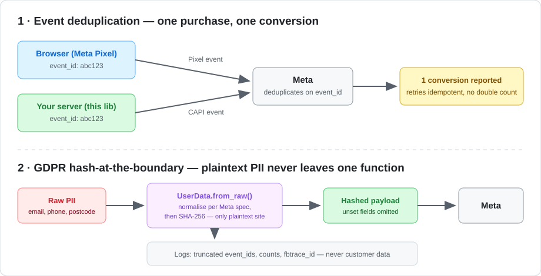

# Meta Conversions API — Production Server-Side Tracking (Python)

A production-grade implementation of Meta's Conversions API (CAPI) for
server-side event tracking, built around three concerns most example code
ignores: **event deduplication**, **GDPR-aware payload design**, and
**operational resilience** (retries, rate limits, PII-safe logging).

> Context: I built and ran a CAPI integration in production as Digital
> Marketing Manager at an education company in London, recovering ~20% of
> attribution data lost to iOS 14+ privacy restrictions. This repo is a
> cleaned-up, generalised version of that pattern.

---

## Why server-side tracking

Browser-only Pixel tracking loses events to ad blockers, Safari ITP and
iOS App Tracking Transparency. Sending the same conversions from your
server restores attribution — but introduces two problems this repo solves:

1. **Double counting** — if both Pixel and server fire for one purchase,
   you report 2 conversions. Solved with shared, deterministic `event_id`s.
2. **PII exposure** — customer data now flows through your backend.
   Solved with hash-at-the-boundary design and data minimisation.

## Architecture



## Key design decisions

### Deduplication (`events.py`)
`event_id` is derived deterministically from the event name + a business
reference (order ID, enquiry ID):

```python
event = ServerEvent.create("Lead", user, reference="enquiry-2026-04-1187")
```

- The browser Pixel sends the same ID → Meta deduplicates Pixel vs server.
- A retried HTTP request produces the same ID → retries are idempotent
  and can never double-count a conversion.

### GDPR-aware payload design (`hashing.py`, `events.py`)
- **Hash at the boundary**: raw PII is SHA-256 hashed inside
  `UserData.from_raw()` and plaintext is never stored on any object.
- **Normalisation per Meta spec** (so match quality doesn't suffer):
  emails lowercased/trimmed; UK phone numbers converted to international
  digits-only form (`07700 900123` → `447700900123`); postcodes
  de-spaced and lowercased.
- **Data minimisation** (GDPR Art. 5(1)(c)): unset fields are omitted
  from the payload entirely, not sent as empty strings.
- **PII-safe logging**: logs carry truncated event_ids, counts and Meta's
  `fbtrace_id` for auditability — never customer data. Logs are safe to
  ship to any aggregator.

### What Meta actually receives

Real output from `examples/send_lead_event.py` — every PII field is already
a SHA-256 hash by the time the payload exists, and the `event_id` is
deterministic so the browser Pixel and any HTTP retry produce the same one:

```json
{
  "event_name": "Lead",
  "event_time": 1781262028,
  "event_id": "d1230cd8e52ad941f1bfef10852c8e52",
  "action_source": "website",
  "user_data": {
    "em": "395ec5f334be0ab5b28568a1e7f6ed5ea80e443fb1ce3d803340586a3df46642",
    "ph": "033134b911b137918338415ee3d20a064b24773d36a3b02e8b99fdd3fcd6b4cd",
    "fn": "9e691cc3bf80c4491b1b0ff55880e453bbe335d562e1c75f341b4af7ad35934c",
    "ln": "f3ef4d448ab0f90b3cbf0df52f5af87e7f3e2b66a169d272b8b7ebf0d290cfba",
    "ct": "6089854c94ca5454b76be6752c562901a985f64c9a946f62976aeab593b83161",
    "zp": "8e1490597899c08af62455101432b986115a0d95e5b10a5ad1e41f80e08f8950",
    "client_ip_address": "203.0.113.7",
    "client_user_agent": "Mozilla/5.0 (example)",
    "fbp": "fb.1.1700000000000.1234567890"
  },
  "event_source_url": "https://example.com/enquiry/thank-you",
  "custom_data": { "currency": "GBP", "value": 2000.0 }
}
```

(IP, user agent and the `_fbp` cookie are sent unhashed per Meta's spec —
they are matching signals, not identity fields.)

### Operational resilience (`client.py`)
- Exponential backoff with jitter on HTTP 429 and Meta throttle codes
  (4, 17, 80004).
- Credentials from environment variables only; the access token is never
  logged or serialised.
- Batch limit enforcement (Meta caps at 1,000 events/request).
- Full Meta error envelope surfaced on non-retryable failures.

## Quick start

```bash
pip install -r requirements.txt python-dotenv pytest
cp .env.example .env        # add your Pixel ID + access token
pytest tests/ -v            # run the unit tests
python examples/send_lead_event.py
```

All 10 unit tests pass (hashing normalisation, deterministic dedup IDs,
GDPR payload checks):

```
tests/test_capi.py::TestHashing::test_email_is_normalised_before_hashing PASSED
tests/test_capi.py::TestHashing::test_uk_phone_national_to_international PASSED
tests/test_capi.py::TestDeduplication::test_event_id_is_deterministic PASSED
tests/test_capi.py::TestGdprPayload::test_no_plaintext_pii_in_payload PASSED
...
============================= 10 passed in 0.62s ==============================
```

Use Meta Events Manager → **Test Events** and set `META_TEST_EVENT_CODE`
in `.env` to verify events arrive and deduplicate before going live.

## Project layout

```
src/capi/
  hashing.py    # PII normalisation + SHA-256 (single auditable boundary)
  events.py     # UserData / ServerEvent models, deterministic event_ids
  client.py     # HTTP client: retries, rate limits, PII-safe logging
examples/
  send_lead_event.py
tests/
  test_capi.py  # hashing normalisation, dedup, GDPR payload checks
```

## What I'd add for a larger deployment

- A queue (e.g. Redis/SQS) between the app and the sender, so conversion
  capture survives Meta outages.
- Event Match Quality monitoring via the Graph API.
- A consent gate: only send events for users with marketing consent
  (GDPR Art. 6) — in my production deployment this was enforced upstream
  at form level.
